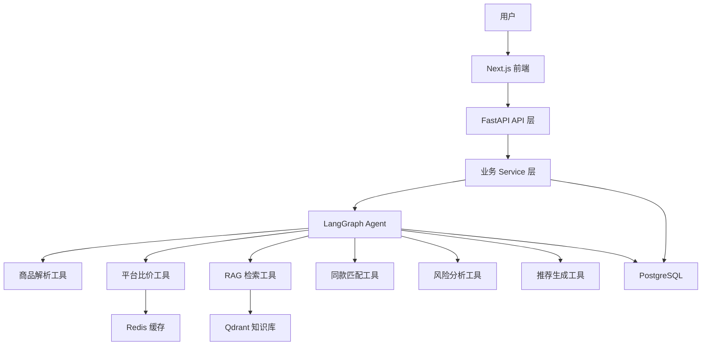
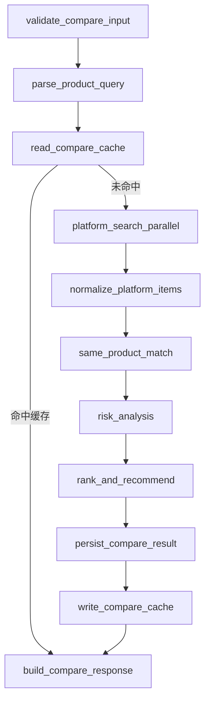
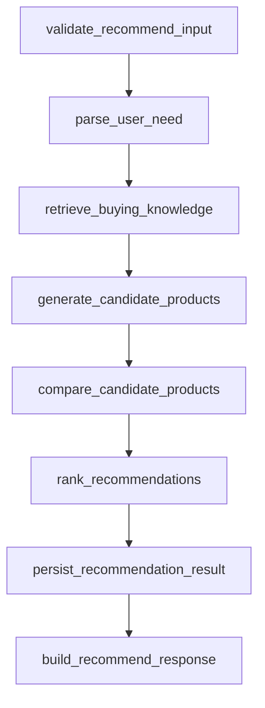
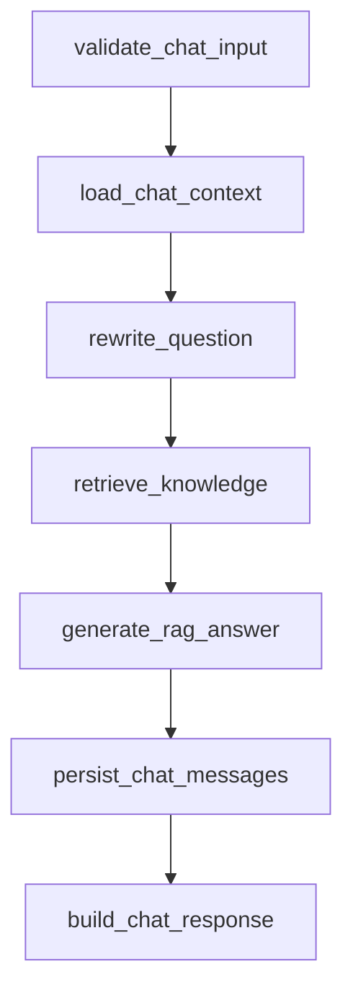
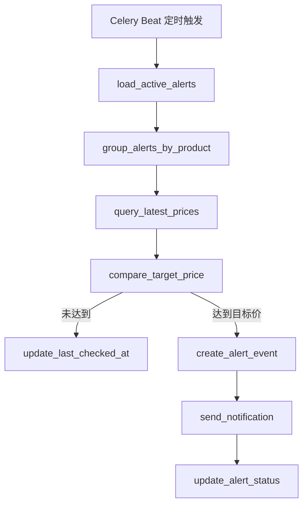

# AI 商品比价与选购智能体流程设计

版本：v0.1  
阶段：第一阶段 MVP  
技术栈：FastAPI + LangGraph + PostgreSQL + Redis + Qdrant  
目标：定义智能体工作流、节点职责、工具边界、状态结构和异常降级策略，作为后端开发依据。

## 1. 设计目标

本项目的智能体不是单纯聊天机器人，而是一个能理解用户购买意图、调用平台比价工具、检索知识库、分析风险并生成购买建议的购物决策 Agent。

第一阶段重点完成三条主流程：

```text
1. 商品比价流程：用户输入明确商品，返回多平台价格、匹配度、风险标签和购买建议。
2. 商品推荐流程：用户输入预算和需求，系统推荐合适商品并解释原因。
3. RAG 问答流程：用户询问商品知识、平台规则、售后政策等，系统检索知识库后回答。
```

第二阶段再增强：

```text
1. 价格历史趋势分析
2. 降价提醒定时任务
3. 真实平台 API 接入
4. Agent 执行过程前端展示
```

## 2. 总体架构



### 2.1 分层职责

| 层级 | 职责 |
| --- | --- |
| API 层 | 参数校验、鉴权预留、请求 ID、统一响应结构 |
| Service 层 | 调用对应 Agent 工作流、事务控制、结果落库 |
| LangGraph Agent | 节点编排、状态流转、工具调用、错误分支 |
| Tools 工具层 | 商品解析、平台查询、RAG 检索、风险分析、排序推荐 |
| Data 层 | PostgreSQL、Redis、Qdrant 的读写封装 |

### 2.2 第一阶段路由策略

第一阶段不强制做复杂的意图识别路由，因为前端已经通过不同接口表达了用户意图：

```text
POST /api/v1/compare    -> compare_graph
POST /api/v1/recommend  -> recommend_graph
POST /api/v1/chat       -> rag_chat_graph
```

后续如果增加一个统一聊天入口，例如 `POST /api/v1/agent`，再加入 `intent_router` 节点。

## 3. Agent 状态设计

LangGraph 中建议使用统一状态对象，三条流程复用部分字段。

```python
class AgentState(TypedDict, total=False):
    request_id: str
    user_id: str | None
    session_id: str | None
    intent: str
    raw_query: str

    platforms: list[str]
    category: str | None

    parsed_product: dict
    parsed_need: dict

    platform_results: list[dict]
    matched_items: list[dict]
    ranked_items: list[dict]

    rag_contexts: list[dict]
    risk_result: dict
    price_history_summary: dict

    final_answer: str
    final_response: dict

    cache_hit: bool
    agent_trace: list[dict]
    errors: list[dict]
```

### 3.1 状态字段说明

| 字段 | 说明 |
| --- | --- |
| request_id | 每次请求唯一 ID，用于日志和 trace |
| user_id | 第一阶段可为空，后续登录后写入 |
| session_id | RAG 问答会话 ID |
| intent | compare、recommend、rag_chat |
| raw_query | 用户原始输入 |
| parsed_product | 商品解析结果，如品牌、型号、容量、版本 |
| parsed_need | 需求解析结果，如预算、用途、偏好 |
| platform_results | 平台工具原始候选结果 |
| matched_items | 同款匹配后的商品 |
| ranked_items | 排序后的结果 |
| rag_contexts | Qdrant 检索出的知识片段 |
| risk_result | 风险分析结果 |
| price_history_summary | 价格历史摘要 |
| final_response | 最终返回给 API 层的数据 |
| agent_trace | 每个节点的执行状态、耗时、错误 |
| errors | 可恢复或不可恢复错误 |

## 4. 商品比价流程

### 4.1 流程图



### 4.2 节点说明

#### validate_compare_input

职责：

```text
1. 校验 query 是否为空
2. 校验 platforms 是否在支持范围内
3. 设置默认 max_results_per_platform
4. 初始化 request_id、agent_trace
```

失败处理：

```text
query 为空 -> 返回 INVALID_ARGUMENT
平台不支持 -> 返回 INVALID_ARGUMENT
```

#### parse_product_query

职责：

```text
1. 从用户输入中提取品牌、型号、容量、版本、颜色等字段
2. 标准化商品名称
3. 输出 parsed_product
```

示例：

```json
{
  "brand": "Apple",
  "name": "iPhone 17 Pro",
  "model": "iPhone 17 Pro",
  "capacity": "256GB",
  "version": "国行",
  "color": null,
  "category": "phone"
}
```

实现建议：

```text
第一阶段可以先用 LLM + 简单规则。
数码产品常见字段用规则兜底，例如容量、国行、港版、Pro、Max。
```

#### read_compare_cache

职责：

```text
1. 根据 query + platforms 生成 query_hash
2. 从 Redis 读取 compare:query:{query_hash}
3. 命中时直接进入 build_compare_response
```

缓存 TTL：

```text
Mock 阶段：15 分钟
真实 API 阶段：5-10 分钟
```

#### platform_search_parallel

职责：

```text
1. 并行调用平台 Adapter
2. 第一阶段使用 MockPlatformAdapter
3. 后续替换为 JDAdapter、TaobaoAdapter、PddAdapter
4. 单个平台失败不影响整体流程
```

工具输入：

```json
{
  "parsed_product": {
    "brand": "Apple",
    "model": "iPhone 17 Pro",
    "capacity": "256GB",
    "version": "国行"
  },
  "platforms": ["jd", "taobao", "pdd"],
  "limit": 5
}
```

工具输出：

```json
[
  {
    "platform": "jd",
    "external_product_id": "jd_100001",
    "title": "Apple iPhone 17 Pro 256GB 国行 全网通",
    "price": 7999,
    "coupon_price": 7799,
    "shop_name": "Apple 产品京东自营旗舰店",
    "shop_type": "self_operated",
    "product_url": "https://example.com/item/100001",
    "image_url": "https://example.com/item/100001.jpg",
    "raw_data": {}
  }
]
```

#### normalize_platform_items

职责：

```text
1. 统一不同平台字段
2. 标准化价格、店铺类型、商品链接、图片链接
3. 过滤明显无效数据，例如无价格、无标题、价格为 0
```

#### same_product_match

职责：

```text
1. 判断候选商品是否与目标商品同款
2. 过滤手机壳、贴膜、二手、维修、配件等结果
3. 计算 match_score
```

第一阶段匹配规则：

```text
1. 标题必须包含核心型号
2. 容量字段必须一致，除非用户未指定容量
3. 版本字段尽量一致，例如国行、港版、美版
4. 出现“手机壳、贴膜、保护套、二手、官换、维修”等词时降低分数或过滤
5. 店铺类型会影响综合评分，但不直接决定是否同款
```

评分建议：

```text
型号匹配：0.40
容量匹配：0.20
版本匹配：0.15
标题风险词：-0.30
店铺可信度：0.10
价格合理性：0.15
```

#### risk_analysis

职责：

```text
1. 识别异常低价
2. 识别疑似二手、配件、容量不一致、版本不一致
3. 识别非官方店铺、券后价不确定、售后风险
4. 输出 risk_tags 和 risk_level
```

风险规则：

```text
价格低于同组中位数 15% 以上 -> abnormal_low_price
标题包含 二手、99新、官换、资源机 -> suspected_used
标题包含 手机壳、贴膜、保护套、钢化膜 -> suspected_accessory
容量与 parsed_product.capacity 不一致 -> capacity_mismatch
版本与 parsed_product.version 不一致 -> version_mismatch
shop_type 为 third_party 且价格明显低 -> non_official_store
coupon_price 存在但 promotion_info 不完整 -> coupon_uncertain
```

#### rank_and_recommend

职责：

```text
1. 对候选商品做综合排序
2. 生成每个商品的推荐理由
3. 生成整体购买建议
```

综合评分建议：

```text
综合分 = match_score * 0.45
      + price_score * 0.25
      + shop_score * 0.15
      + risk_score * 0.15
```

说明：

```text
最低价不一定排第一。
高风险低价商品可以展示，但不应直接作为首推。
```

#### persist_compare_result

职责：

```text
1. 写入或更新 products
2. 写入或更新 platform_products
3. 写入 price_records
4. 写入 compare_queries
5. 写入 compare_query_items
```

对应数据库表：

```text
products
platform_products
price_records
compare_queries
compare_query_items
```

#### build_compare_response

职责：

```text
1. 按接口文档组装响应
2. 保留 agent_trace
3. 返回 normalized_product、summary、items、buying_advice
```

## 5. 商品推荐流程

### 5.1 流程图



### 5.2 节点说明

#### validate_recommend_input

职责：

```text
1. 校验 query 是否为空
2. 校验预算范围是否合理
3. 设置 category、limit、platforms 默认值
```

#### parse_user_need

职责：

```text
1. 解析预算区间
2. 解析品类
3. 解析用途和偏好
4. 解析排除条件
```

示例输出：

```json
{
  "category": "phone",
  "budget_min": 3000,
  "budget_max": 5000,
  "preferences": ["拍照", "续航"],
  "usage": ["日常使用", "旅行拍照"],
  "avoid": ["二手机", "非国行"]
}
```

#### retrieve_buying_knowledge

职责：

```text
1. 根据 parsed_need 从 Qdrant 检索选购知识
2. 优先按 category 过滤
3. 返回 rag_contexts
```

检索策略：

```text
top_k 默认 5
商品推荐场景可提高到 8
category 为空时不加过滤
```

#### generate_candidate_products

职责：

```text
1. 结合用户需求和 RAG 知识生成候选商品名称
2. 候选数量建议 3-8 个
3. 每个候选商品需要包含推荐理由草稿
```

第一阶段可采用：

```text
LLM 根据知识库和 Mock 商品库生成候选商品。
如果没有足够知识，优先从 Mock 商品池按预算和品类筛选。
```

#### compare_candidate_products

职责：

```text
1. 对每个候选商品复用商品比价子流程
2. 获取各平台价格和风险标签
3. 输出候选商品当前价格区间和最佳购买平台
```

注意：

```text
这里不必完整保存每一次 compare_query。
可以只保存 recommendation_queries.result。
如果用户点开某个候选商品详情，再触发正式比价流程。
```

#### rank_recommendations

职责：

```text
1. 综合预算匹配、偏好匹配、价格、店铺可信度、风险进行排序
2. 生成推荐原因、适合人群、风险提示、替代选择
```

评分建议：

```text
预算匹配：0.25
需求匹配：0.30
当前价格：0.20
平台可信度：0.10
风险控制：0.15
```

#### persist_recommendation_result

职责：

```text
1. 写入 recommendation_queries
2. 保存 parsed_need、result、rag_references、agent_trace
```

#### build_recommend_response

职责：

```text
1. 按接口文档组装推荐响应
2. 返回 parsed_need、items、rag_references、final_advice
```

## 6. RAG 选购问答流程

### 6.1 流程图



### 6.2 节点说明

#### validate_chat_input

职责：

```text
1. 校验 question 是否为空
2. 校验 top_k 范围
3. 初始化 session_id
```

#### load_chat_context

职责：

```text
1. 如果传入 session_id，读取最近 N 条消息
2. 第一阶段默认读取最近 6 条
3. 如果无 session_id，创建新会话
```

#### rewrite_question

职责：

```text
1. 结合上下文改写用户问题
2. 将“它”“这个平台”等指代补全
3. 输出适合检索的 standalone_question
```

示例：

```text
用户上一轮问：iPhone Pro 和 Pro Max 有什么区别？
用户本轮问：那 256GB 够用吗？
改写后：购买 iPhone Pro 或 Pro Max 时，256GB 存储容量是否够用？
```

#### retrieve_knowledge

职责：

```text
1. 从 Qdrant 检索相关知识切片
2. 根据问题类型选择 category 或 source 过滤
3. 返回 references
```

#### generate_rag_answer

职责：

```text
1. 严格基于检索内容回答
2. 不确定时明确说明
3. 输出自然语言回答、关键建议、相关问题
```

回答要求：

```text
1. 不编造平台政策
2. 不承诺价格和售后一定有效
3. 涉及平台规则时提示以商品页和平台官方说明为准
4. 语言要像购物顾问，不要像百科条目
```

#### persist_chat_messages

职责：

```text
1. 写入用户消息
2. 写入助手回答
3. 保存 references、模型信息、耗时等 metadata
```

对应数据库表：

```text
chat_sessions
chat_messages
```

## 7. 降价提醒流程

降价提醒第一阶段只预留接口和数据库结构，第二阶段实现后台任务。

### 7.1 第二阶段流程图



### 7.2 任务策略

```text
1. 每 30-60 分钟扫描 active 状态提醒
2. 按 product_id 聚合，避免重复查询同一商品
3. 优先使用缓存，缓存过期后再调用平台 Adapter
4. 触发提醒后写入 alert_events
5. 第一版通知渠道只做站内提醒
```

## 8. 工具设计

### 8.1 商品解析工具 ProductParseTool

输入：

```json
{
  "query": "iPhone 17 Pro 256GB 国行"
}
```

输出：

```json
{
  "brand": "Apple",
  "model": "iPhone 17 Pro",
  "capacity": "256GB",
  "version": "国行",
  "category": "phone"
}
```

### 8.2 平台搜索工具 PlatformSearchTool

输入：

```json
{
  "platform": "jd",
  "query": "iPhone 17 Pro 256GB 国行",
  "limit": 5
}
```

输出：

```json
{
  "platform": "jd",
  "items": []
}
```

实现方式：

```text
第一阶段：MockPlatformAdapter
第二阶段：接入一个真实平台 API
第三阶段：接入京东、淘宝、拼多多多个平台
```

### 8.3 RAG 检索工具 RagSearchTool

输入：

```json
{
  "query": "拼多多百亿补贴靠谱吗？",
  "category": null,
  "top_k": 5
}
```

输出：

```json
{
  "contexts": [
    {
      "chunk_id": "kb_pdd_001",
      "title": "拼多多百亿补贴注意事项",
      "content": "知识片段正文",
      "score": 0.87
    }
  ]
}
```

### 8.4 同款匹配工具 ProductMatchTool

输入：

```json
{
  "parsed_product": {},
  "items": []
}
```

输出：

```json
{
  "items": [
    {
      "platform": "jd",
      "title": "Apple iPhone 17 Pro 256GB 国行 全网通",
      "match_score": 0.96,
      "match_reasons": ["型号一致", "容量一致", "版本一致"]
    }
  ]
}
```

### 8.5 风险分析工具 RiskAnalysisTool

输入：

```json
{
  "parsed_product": {},
  "items": []
}
```

输出：

```json
{
  "items": [
    {
      "external_product_id": "jd_100001",
      "risk_tags": [],
      "risk_level": "low",
      "risk_explanation": "价格和标题信息正常。"
    }
  ]
}
```

### 8.6 推荐排序工具 RecommendationRankTool

输入：

```json
{
  "parsed_need": {},
  "candidate_products": [],
  "price_results": []
}
```

输出：

```json
{
  "items": [],
  "final_advice": "优先选择售后稳定、价格处于合理区间的机型。"
}
```

## 9. Prompt 设计原则

### 9.1 商品解析 Prompt

要求：

```text
1. 只输出 JSON
2. 无法确定的字段输出 null
3. 不要补充用户没说的颜色、版本、容量
4. 品类限定为 phone、laptop、earphone、tablet、other
```

### 9.2 推荐生成 Prompt

要求：

```text
1. 推荐必须符合预算
2. 推荐理由必须对应用户偏好
3. 不要虚构不存在的实时价格
4. 实时价格必须来自平台比价工具
5. 不确定时给出替代选择和风险说明
```

### 9.3 RAG 问答 Prompt

要求：

```text
1. 优先基于检索内容回答
2. 引用来源必须来自 rag_contexts
3. 不知道就说明无法确认
4. 涉及售后、保修、优惠时提醒以平台页面为准
```

## 10. 异常处理与降级

### 10.1 平台 API 失败

策略：

```text
1. 单个平台失败，不中断整个比价流程
2. 返回其他平台结果
3. 在 agent_trace 中记录失败平台和错误信息
4. 如果有 Redis 缓存，可以返回缓存并标记 cache_hit=true
```

### 10.2 RAG 检索为空

策略：

```text
1. 回答中说明知识库暂无足够信息
2. 可以给出通用建议，但必须明确是不基于知识库引用
3. references 返回空数组
```

### 10.3 LLM 调用失败

策略：

```text
1. 商品解析失败时使用规则解析兜底
2. 推荐生成失败时返回结构化候选商品和简单规则推荐
3. RAG 回答失败时返回友好错误
```

### 10.4 数据库写入失败

策略：

```text
1. 如果核心查询已成功，允许返回结果
2. 记录日志和 agent_trace
3. 标记 persist_status=failed
4. 不因价格记录写入失败导致用户请求失败
```

## 11. 观测与日志

每个节点都要记录：

```json
{
  "node": "platform_search_parallel",
  "status": "success",
  "duration_ms": 1800,
  "input_summary": {
    "platforms": ["jd", "taobao", "pdd"]
  },
  "output_summary": {
    "item_count": 12
  },
  "error": null
}
```

日志建议：

```text
1. request_id 全链路贯穿
2. 不记录用户敏感信息
3. 平台 API 原始响应只在 debug 模式记录
4. Agent trace 写入 compare_queries、recommendation_queries 或 chat_messages.metadata
```

## 12. 性能要求

第一阶段目标：

```text
商品比价：3-8 秒
商品推荐：5-12 秒
RAG 问答：2-6 秒
```

优化策略：

```text
1. 平台查询并行执行
2. Redis 缓存热门商品查询
3. RAG top_k 控制在 5 左右
4. 推荐流程候选商品数量不要超过 8 个
5. 对外部 API 设置超时，单个平台建议 2-4 秒
```

## 13. 第一阶段开发优先级

### 13.1 必须实现

```text
1. compare_graph
2. recommend_graph
3. rag_chat_graph
4. MockPlatformAdapter
5. ProductParseTool
6. ProductMatchTool
7. RiskAnalysisTool
8. RagSearchTool
9. PostgreSQL 结果落库
10. Redis 比价缓存
```

### 13.2 可以简化

```text
1. 推荐结果明细可以先用 JSONB 保存
2. 同款匹配可以先用规则 + LLM 辅助
3. 价格历史可以先来自 price_records，不做复杂趋势图
4. 用户体系先不做登录，只预留 user_id
```

### 13.3 暂不实现

```text
1. 真实平台 API
2. 邮件、微信、短信提醒
3. 大规模并发优化
4. 复杂用户画像
5. 自动爬取电商页面
```

## 14. 验收标准

### 14.1 商品比价验收

```text
输入：iPhone 17 Pro 256GB 国行
系统应返回：
1. 至少 3 个平台候选结果
2. 每个结果包含价格、券后价、店铺、链接、匹配度
3. 能过滤明显配件和二手商品
4. 能标记价格异常或售后风险
5. 能给出最终购买建议
```

### 14.2 商品推荐验收

```text
输入：预算 5000，想买拍照好、续航强的手机
系统应返回：
1. 3-5 个推荐商品
2. 每个商品包含推荐理由
3. 能展示当前价格区间
4. 能给出推荐购买平台
5. 能说明风险和替代选择
```

### 14.3 RAG 问答验收

```text
输入：拼多多百亿补贴靠谱吗？
系统应返回：
1. 自然语言回答
2. 关键建议
3. 知识库引用来源
4. 相关问题推荐
5. 不编造无法确认的平台规则
```

## 15. 后端目录建议

```text
backend/
  app/
    api/
      routes_compare.py
      routes_recommend.py
      routes_chat.py
    agents/
      compare_graph.py
      recommend_graph.py
      rag_chat_graph.py
      state.py
    tools/
      product_parse.py
      platform_search.py
      product_match.py
      risk_analysis.py
      rag_search.py
      recommendation_rank.py
    adapters/
      base.py
      mock_platform.py
      jd.py
      taobao.py
      pdd.py
    services/
      compare_service.py
      recommend_service.py
      chat_service.py
    repositories/
      product_repo.py
      compare_repo.py
      knowledge_repo.py
    core/
      config.py
      logging.py
      errors.py
```

## 16. 开发顺序建议

```text
1. 建 FastAPI 项目骨架
2. 建数据库 migration
3. 实现 MockPlatformAdapter
4. 实现 compare_graph
5. 接通 /api/v1/compare
6. 实现知识库导入和 Qdrant 检索
7. 实现 rag_chat_graph 和 /api/v1/chat
8. 实现 recommend_graph 和 /api/v1/recommend
9. 前端接入三个主接口
10. 补充日志、缓存、错误处理和基础测试
```
